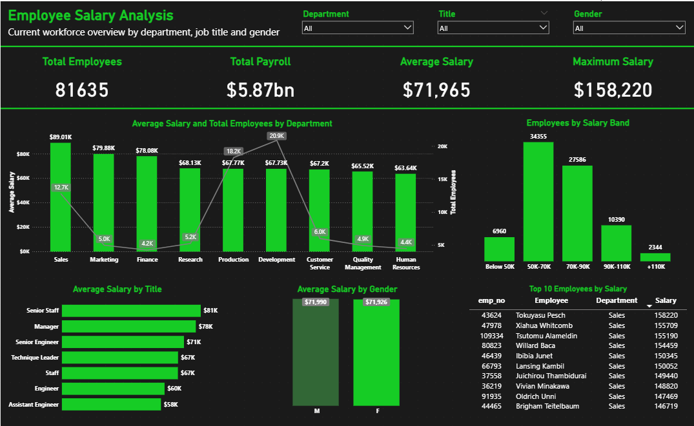

# Employee Salary Analysis

## Project Overview

This project combines SQL and Power BI to analyze the current workforce and salary structure of a fictional company.

The data was extracted from the MySQL Employees Sample Database. SQL was used to join employee, salary, job title, and department information. The prepared dataset was then imported into Power BI for analysis and visualization.



## Business Questions

The report was created to answer the following questions:

- How many employees currently work for the company?
- What are the total, average, and maximum salary values?
- Which departments and job titles have the highest average salaries?
- How are employees distributed across salary bands?
- How does the average salary differ by gender?
- Who are the top 10 highest-paid employees?
- How many employees work in each department?

## Tools Used

- MySQL
- SQL
- Power Query
- Power BI
- DAX

## Data Preparation

The SQL query combines data from the following tables:

- `employees`
- `salaries`
- `titles`
- `dept_emp`
- `departments`

Only current employee records were selected by filtering active salary, title, and department assignments using:

```sql
to_date = '9999-01-01'

In Power Query, employees were grouped into the following salary bands:

Below 50K
50K–70K
70K–90K
90K–110K
110K+

A separate sorting column was created to display the salary bands in the correct order.

Dashboard Features

The Power BI dashboard includes:

KPI cards for total employees, total payroll, average salary, and maximum salary
Average salary and employee count by department
Employee distribution by salary band
Average salary by job title
Average salary comparison by gender
Top 10 highest-paid employees
Department, job title, and gender slicers

Some slicer interactions were intentionally disabled for the corresponding comparison visuals. For example, the department slicer does not filter the department chart, allowing users to preserve the full departmental comparison.

Key Insights
The company has 81,635 current employees.
The total payroll is approximately 5.87 billion salary units.
The average salary is 71,965.
The maximum salary is 158,220.
The Sales department has the highest average salary at approximately 89.01K.
Production has the largest workforce, with approximately 20.9K employees.
The largest salary group is 50K–70K, containing 34,355 employees.
Average salaries for male and female employees are almost equal.
Project Files
employee_salary_analysis.sql — SQL query used to extract the data
employee_salary_analysis.pbix — interactive Power BI report
employee_salary_dashboard.png — dashboard preview
Data Source

This project uses the fictional MySQL Employees Sample Database.

Author

Bohdan Varchenko
